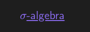

# Obsidian MathJax WikiLinks

Obsidian plugin to render MathJax within WikiLinks.

## Example

In vanilla obsidian, the WikiLink `[[sigma-algebra|$\sigma$-algebra]]` renders without the MathJax expression as follows:

while links of the form `[$\sigma$-algebra](sigma-algebra.md)` will render correctly:

This plugin unifies the two versions, rendering MathJax properly in the first case.

## Manual Installation

To install this plugin manually, simply copy `main.js` and `manifest.json` into a folder `VAULT_PATH/.obsidian/plugins/obsidian-mathjax-wikilinks`.
